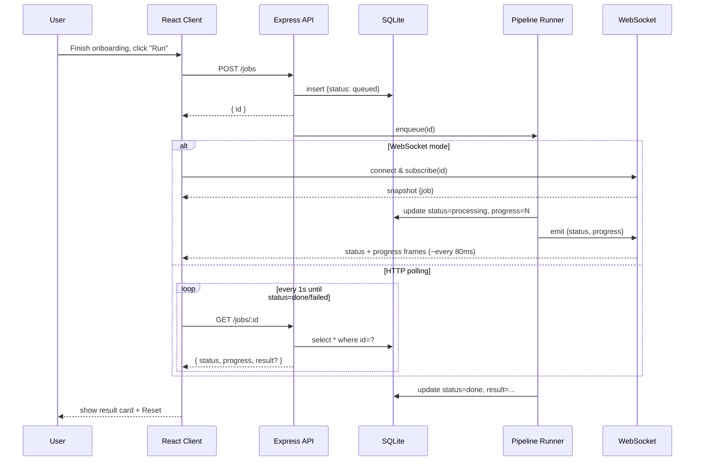

# BlockFlow

A full-stack demo app: a 3-step onboarding wizard followed by a job-processing screen that runs a backend pipeline two ways — live progress over **WebSocket** and status polling over **HTTP**.

**Live links**
- Frontend: https://block-flow-565.web.app
- Backend: https://block-flow.onrender.com/health
- GitHub: https://github.com/Nazarin565/block-flow

---

## Part 0 — How it works

### User scenarios

**WebSocket flow.**
User completes onboarding, lands on the processing screen, clicks **"Run via WebSocket"**. The client `POST /jobs`, receives `{ id }`, opens a WebSocket connection and sends `{ type: "subscribe", jobId }`. The pipeline runs server-side; each sub-step emits a `progress` frame (~every 80 ms). The circular progress bar fills smoothly 0 → 100 %. On `done`, a personalised result card appears with a **Reset** button.

**HTTP polling flow.**
Same screen, clicks **"Run via HTTP"**. The client `POST /jobs`, receives `{ id }`, shows an indeterminate progress bar. It polls `GET /jobs/:id` every second. When `status === "done"`, polling stops and the result card renders. **Reset** clears state and returns to step 1.

### Flow diagram



---

## Architecture decisions

### Monorepo, no workspaces
One repo, two deployables (`client/` and `server/`). Reviewers open a single repo and see the whole system. Deploy is still fully independent — Firebase Hosting builds only `client/dist`; Render uses `Root Directory = server` and ignores everything else. Atomic contract changes: updating a WS message shape touches both sides in one commit so they never drift.

### SQLite via better-sqlite3
- **Zero infrastructure** — a single file on disk, no DB server to provision or pay for.
- **Synchronous API** — pipeline code stays focused on job logic rather than async DB plumbing.
- **Easy local dev** — one file, behaves identically on a reviewer's machine and on the deployed host.
- **Fits the data shape** — the `jobs` table has 5 columns; schema is inlined in `db/client.ts` as `CREATE TABLE IF NOT EXISTS` (idempotent on every boot, no migration framework needed).
- Trade-off accepted: single-writer, not horizontally scalable. Fine for a one-process demo.

### Extensible pipeline
Each pipeline step is its own module. Adding a new step means: create a file, push it into the `STEPS` array in `pipeline/index.ts`. No other code changes. The runner iterates `STEPS` generically and never knows how many steps there are.

### API types duplicated, not shared
`client/src/api/types.ts` and `server/src/jobs/types.ts` hold identical small definitions. The contract surface is tiny; plain duplication beats introducing a shared package or tsconfig path mapping at this scale.

### WebSocket protocol
Client sends `{ type: "subscribe", jobId }`. Server replies with a `snapshot` frame (current DB state), then streams `status` and `progress` frames (~every 80 ms from sub-step ticks), and closes the socket after a `done` or `failed` frame.

---

## Local development

```bash
# Backend — http://localhost:3000
cd server && npm i && npm run dev

# Frontend — http://localhost:5173
cd client && npm i && npm run dev
```

Backend smoke checks:
```bash
curl -X POST http://localhost:3000/jobs          # → { "id": "..." }
curl http://localhost:3000/jobs/<id>             # → job object
wscat -c ws://localhost:3000                     # then send:
# {"type":"subscribe","jobId":"<id>"}
```

### Switching between local and deployed backend

| File | Purpose |
|------|---------|
| `client/.env.development` | Points to `localhost:3000` — used by `npm run dev` |
| `client/.env.production` | Points to the Render URL — used by `npm run build` |

---

## Project layout

```
BlockFlow/
├── docs/
│   ├── PLAN.md              — architecture decisions & stack rationale
│   ├── IMPLEMENTATION.md    — step-by-step build guide
│   └── flow-diagram.md      — Mermaid sequence diagram
├── client/                  — Vite + React 18 + TypeScript
│   ├── .env.development     — local API/WS URLs
│   ├── .env.production      — deployed API/WS URLs
│   └── src/
│       ├── api/             — HTTP + WebSocket client wrappers + shared types
│       ├── components/      — shared UI components (CSS Modules)
│       ├── screens/         — Step1–Step4 wizard screens
│       ├── state/           — useOnboarding hook
│       ├── App.tsx          — root component, screen routing
│       └── main.tsx         — entry point
└── server/                  — Node + Express + TypeScript (ESM)
    └── src/
        ├── index.ts         — server entry: Express + WebSocket boot
        ├── config.ts        — reads PORT, DATABASE_PATH, CORS_ORIGIN from env
        ├── db/              — SQLite client, idempotent schema init
        ├── jobs/            — types, repo, events, runner
        ├── pipeline/        — extensible step array + step modules
        ├── routes/          — POST /jobs, GET /jobs/:id
        └── ws/              — WebSocket server, job subscriptions
```
