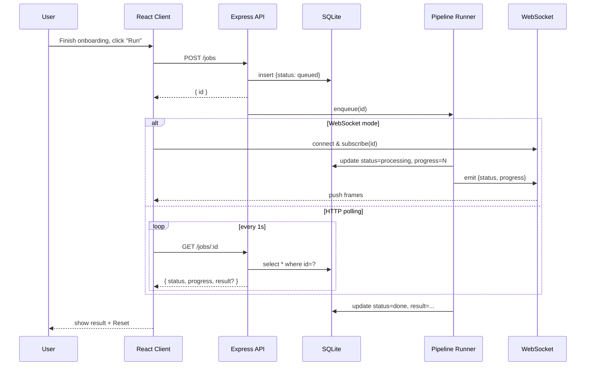

# BlockFlow — Implementation Plan

## Context

BlockFlow is a small full-stack demo application that:

1. Walks a user through a 3-step onboarding wizard (wish selection, current
   weight, goal weight).
2. On the final "processing" screen, lets the user launch a backend **job** two
   different ways — once over **WebSocket** (real-time `0–100%` progress) and
   once over **HTTP polling** (indeterminate progress bar, then a mocked
   result), plus a **Reset** button that returns to step 1.
3. The backend creates the job, persists it in SQLite, runs it through an
   easily-extensible multi-step pipeline (`setTimeout`-emulated work), and
   exposes both a REST API and a WebSocket channel for status updates.

The current repository is essentially empty (only an empty `README.md`), so
this is a greenfield build. This plan covers structure, stack, screens,
backend, deployment, and the README deliverable.

---

## Stack & Repo Strategy

### Stack

| Layer       | Choice                                    | Reason                                                                 |
|-------------|-------------------------------------------|------------------------------------------------------------------------|
| Frontend    | **Vite + React 18 + TypeScript**          | Fast HMR, first-class TS, simplest build that targets Firebase Hosting |
| Styling     | CSS Modules (or plain CSS)                | Spec says "basic markup, no pixel-perfect" — no UI framework needed    |
| Backend     | **Node.js + Express + TypeScript**        | Same language as FE; trivial to host                                   |
| WebSocket   | **`ws`** library                          | Minimal, no extra abstractions                                         |
| Database    | **SQLite** via **`better-sqlite3`**       | See dedicated section below                                            |
| Deploy FE   | **Firebase Hosting** (required by spec)   | Spec mandates this                                                     |
| Deploy BE   | **Render** (or Railway / Fly.io)          | Free tier, persistent disk for SQLite, WebSocket support out of box    |

### Repo strategy — single monorepo, no workspaces

```
BlockFlow/                  ← one git repo, one GitHub link
├── README.md
├── docs/
│   ├── PLAN.md             ← this file
│   └── flow-diagram.md     ← Part-0 Mermaid diagram
├── client/                 ← Vite + React + TS, own package.json
└── server/                 ← Express + ws + SQLite + TS, own package.json
```

**Why monorepo (and not two separate repos):**
- The spec asks for "GitHub links" but submission is one PR — reviewers should
  open **one** repo and see the whole system. Two repos force them to context-
  switch and keep contracts aligned manually.
- Local dev is trivial: `cd server && npm i && npm run dev` (port 3000) and
  `cd client && npm i && npm run dev` (port 5173) — both in one worktree.
- **Deploy is still fully independent**:
  - **Firebase Hosting** builds only `client/dist` (configured via
    `firebase.json` in repo root).
  - **Render** is set with `Root Directory = server` — it installs and builds
    only the backend subfolder. Everything outside `server/` is ignored.
- Atomic contract changes: updating a WS message shape touches `client/` and
  `server/` in one commit, so they can never drift.

**Why no workspaces:** the project is small. Workspaces shine with 3+ packages
and shared tooling; here they only add config and complicate Render's build
without giving anything back.

### Sharing API types

Plain duplication: `client/src/api/types.ts` and `server/src/jobs/types.ts`
hold identical small definitions (Job shape, 4 statuses, 3 WS message types).
The contract is tiny; copy-keep-aligned beats introducing a shared package or
tsconfig path mapping for this size of project.

### Why SQLite (also documented in README)

- **Zero infrastructure.** A single file on disk; no DB server to provision,
  configure, or pay for.
- **Spec explicitly allows it** ("PostgreSQL / MongoDB / SQLite … minimal DB
  integration is enough") — SQLite is the lowest-overhead option that still
  satisfies the requirement.
- **Fits the data shape.** The `jobs` table has 5 columns of trivial schema;
  nothing benefits from a network DB.
- **`better-sqlite3` is synchronous**, so the pipeline code stays focused on
  job/pipeline logic rather than DB plumbing.
- **Easy local dev.** One file, ships with the repo, behaves identically on a
  reviewer's machine and on the deployed host.
- **Deployable.** Render / Fly.io offer a persistent disk so the SQLite file
  survives restarts. (If a free tier doesn't persist, the demo simply resets on
  redeploy — acceptable here.)
- **Trade-off accepted.** SQLite is single-writer and not horizontally
  scalable. Fine for a one-process demo; the upgrade path to Postgres is
  straightforward if it were ever needed.

---

## Part 0 — Design (lives in README + `docs/flow-diagram.md`)

### User scenarios

1. **WebSocket flow.** User completes onboarding, lands on the processing
   screen, clicks **"Run via WebSocket"**. Frontend `POST /jobs`, receives
   `{ id }`, opens a WebSocket and subscribes to that `id`. Pipeline runs
   server-side; each step pushes a `{ status, progress }` frame. The progress
   bar fills `0 → 100%`. On `done`, the mock result renders and a **Reset**
   button appears.

2. **HTTP polling flow.** Same screen, clicks **"Run via HTTP"**. Frontend
   `POST /jobs`, receives `{ id }`, shows an **indeterminate** progress bar.
   It polls `GET /jobs/:id` every ~1s. On `status === "done"`, polling stops
   and the mock result renders. **Reset** clears state and returns to step 1.

### High-level flow (Mermaid)



---

## Part 1 — Frontend (`client/`)

Wizard state lives in a single hook (`useOnboardingState`); no router needed —
the wizard advances by incrementing a `step` index. All four screens render
under a shared `<Header />`.

### Step 1 — "What is your main wish?"
- 5 `<SelectCard />` rows (single-select; radio semantics).
- Continue button disabled until a selection exists.
- Option list is a local const — content is irrelevant to the demo.

### Step 2 — "What is your weight?"
- `<SegmentedControl />` for kg / lbs.
- `<NumberInput />` — digits + decimal only, validates `> 0`.
- Continue enabled when input is valid.

### Step 3 — "What is your goal weight?"
- Same components/validation as Step 2 (reuse `<SegmentedControl />` and
  `<NumberInput />`).

### Step 4 — Processing
- Two large buttons: **"Run via WebSocket"** and **"Run via HTTP"**.
- When a job is in flight:
  - **WebSocket mode** → linear/circular bar with `%` label, driven by WS
    frames.
  - **HTTP mode** → indeterminate CSS-animated bar, no percentage.
- On `done`: render a mock result card (e.g. a small "review" card with 5
  stars and a placeholder quote), plus a **Reset** button that clears state
  and returns to step 1.

### Frontend file layout

```
client/
├── index.html
├── package.json
├── vite.config.ts
├── tsconfig.json
├── .env.development         # VITE_API_BASE_URL, VITE_WS_URL → localhost
├── .env.production          # → deployed Render URL
└── src/
    ├── main.tsx
    ├── App.tsx
    ├── api/
    │   ├── types.ts         # Job, JobStatus, WsMessage (duplicated from server)
    │   ├── http.ts          # POST /jobs, GET /jobs/:id (polling helper)
    │   └── ws.ts            # WebSocket client wrapper
    ├── state/
    │   └── onboarding.ts    # wizard state (step, wish, weight, goal)
    ├── screens/
    │   ├── Step1Wish.tsx
    │   ├── Step2Weight.tsx
    │   ├── Step3Goal.tsx
    │   └── Step4Processing.tsx
    └── components/
        ├── Header.tsx
        ├── Button.tsx
        ├── SelectCard.tsx
        ├── SegmentedControl.tsx
        ├── NumberInput.tsx
        └── ProgressBar.tsx
```

---

## Part 2 — Backend (`server/`)

### REST API (`server/src/routes/jobs.ts`)

| Method | Path        | Behavior                                                                       |
|--------|-------------|--------------------------------------------------------------------------------|
| POST   | `/jobs`     | Insert row `{status: 'queued', progress: 0}`; enqueue runner; return `{id}`    |
| GET    | `/jobs/:id` | Read row from DB; return `{id, status, progress, result?, createdAt}` or 404   |

### Job lifecycle

```
queued → processing → done
                    ↘ failed
```

- Created `queued` synchronously inside `POST /jobs`.
- Runner picks it up immediately (in-process, no external queue), flips to
  `processing`, walks the pipeline, updates `progress` after each step, finally
  sets `done` (or `failed` on thrown error).

### Pipeline (`server/src/pipeline/`)

- An array of async step functions, executed sequentially.
- Each step is its own module → adding a step is "create file + push into the
  exported array".
- Each step `await`s a `setTimeout` (1.5–2.5s) to emulate work.
- After each step finishes, the runner: (a) writes `progress` to DB, (b) emits
  a `progress` event on the shared `EventEmitter` so WS subscribers receive
  live updates.

Initial steps (stubs):
1. `step1-prepare.ts` — "validate input"
2. `step2-process.ts` — "crunch data"
3. `step3-finalize.ts` — "build result"

### WebSocket (`server/src/ws/server.ts`)

- Single `ws` server attached to the same HTTP server.
- Client message format: `{"type":"subscribe","jobId":"..."}`.
- Server replies with a snapshot from DB, then forwards every subsequent
  `EventEmitter` event for that `jobId`:
  - `{type:'status',   status:'queued'|'processing'|'done'|'failed'}`
  - `{type:'progress', progress: 0–100}`
  - `{type:'done',     result: ...}`
- One subscription per connection is sufficient for the demo.

### DB (`server/src/db/`)

- `better-sqlite3` opens `data.sqlite` next to the process (path overridable
  via `DATABASE_PATH` env so Render's persistent disk mount works).
- On boot, run `schema.sql` (idempotent `CREATE TABLE IF NOT EXISTS`).
- `repo.ts` exposes `createJob()`, `getJob(id)`, `updateJob(id, patch)` —
  pure synchronous functions.

Schema:
```sql
CREATE TABLE IF NOT EXISTS jobs (
  id         TEXT PRIMARY KEY,
  status     TEXT NOT NULL CHECK (status IN ('queued','processing','done','failed')),
  progress   INTEGER NOT NULL DEFAULT 0,
  result     TEXT,             -- JSON-encoded mock payload
  createdAt  INTEGER NOT NULL  -- epoch ms
);
```

### Architecture rules (per spec)

- API, job logic, and pipeline live in separate modules — no "all in one file".
- No auth.
- Mock results are fine.
- No ORM, no migration framework.

### Backend file layout

```
server/
├── package.json
├── tsconfig.json
└── src/
    ├── index.ts             # boot: http server + ws server
    ├── config.ts            # PORT, DATABASE_PATH, CORS_ORIGIN
    ├── db/
    │   ├── schema.sql
    │   └── client.ts        # better-sqlite3 instance + idempotent init
    ├── jobs/
    │   ├── types.ts         # Job, JobStatus, WsMessage (mirror of client)
    │   ├── repo.ts          # createJob, getJob, updateJob
    │   ├── runner.ts        # orchestrates pipeline; emits events
    │   └── events.ts        # shared EventEmitter
    ├── pipeline/
    │   ├── index.ts         # exports STEPS array
    │   ├── step1-prepare.ts
    │   ├── step2-process.ts
    │   └── step3-finalize.ts
    ├── routes/
    │   └── jobs.ts          # POST /jobs, GET /jobs/:id
    └── ws/
        └── server.ts        # ws server, subscribe by jobId
```

---

## Deployment

### Frontend → Firebase Hosting
1. `firebase init hosting` from repo root, public dir = `client/dist`, SPA
   rewrite to `index.html`.
2. Build + deploy: `cd client && npm run build && firebase deploy --only hosting`.
3. `VITE_API_BASE_URL` and `VITE_WS_URL` set via `client/.env.production`
   pointing to the Render backend.

### Backend → Render (recommended)
1. New Web Service. **Root Directory = `server`**. Build = `npm install && npm run build`. Start = `node dist/index.js`.
2. Add a persistent disk mounted at `/data`; set `DATABASE_PATH=/data/data.sqlite`.
3. WebSockets work out of the box on Render web services.
4. CORS: allow the Firebase Hosting origin.

---

## README contents (deliverable)

- Project overview (1–2 paragraphs).
- Live links: deployed frontend (Firebase), deployed backend (Render), GitHub repo.
- **Part 0**: the two user scenarios and the Mermaid flow diagram (or link to
  `docs/flow-diagram.md`).
- **Architecture decisions**, including the SQLite rationale from this plan.
- Local dev:
  ```
  cd server && npm i && npm run dev   # http://localhost:3000
  cd client && npm i && npm run dev   # http://localhost:5173
  ```
- How to switch the client between local and deployed backend (env vars).

---

## Verification (end-to-end)

1. **REST smoke.** `curl -X POST localhost:3000/jobs` → `{id}`; immediate
   `curl localhost:3000/jobs/<id>` shows `queued`/`processing`; after ~6s
   shows `done` with `progress: 100`.
2. **WebSocket smoke.** `wscat -c ws://localhost:3000`, send
   `{"type":"subscribe","jobId":"<id>"}`, observe `status` + `progress` frames
   culminating in `done`.
3. **Frontend manual.** `npm run dev` in `client/`; walk through the 3
   onboarding steps; on step 4 try both buttons; confirm the WS run shows live
   `%` and the HTTP run shows an indeterminate bar then result; Reset returns
   to step 1 with cleared state.
4. **Deployed end-to-end.** Repeat (3) against the Firebase URL hitting the
   Render backend (verify CORS + WS upgrade work over HTTPS).
5. **Extensibility check.** Add a fourth pipeline step file and push it into
   the `STEPS` array; rerun a job; progress should reach 100% over 4 steps
   without other code changes.

---

## Implementation Order

1. Scaffold `server/` — Express, `ws`, SQLite, jobs route, pipeline with 3
   stub steps, in-memory subscription.
2. Smoke-test backend with `curl` and `wscat`.
3. Scaffold `client/` — Vite + React + TS, shared `Header`, wizard state.
4. Build steps 1–3 of the wizard (pure UI, no backend yet).
5. Build step 4 with both run modes, wired to the backend.
6. Write the README (Part 0 + architecture + links).
7. Deploy backend to Render, then deploy client to Firebase with the right
   env vars.
8. Final end-to-end check on the deployed URLs.
